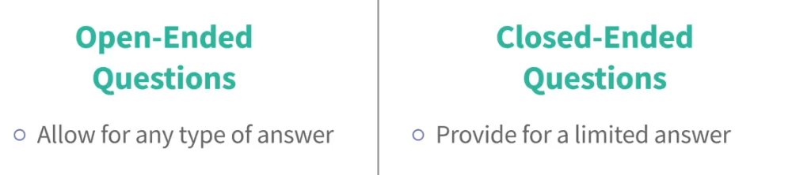
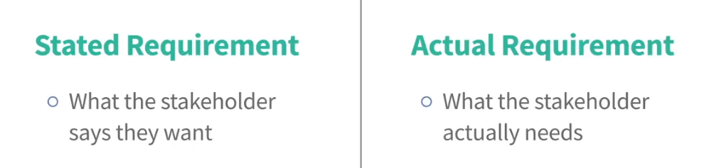

# Business Analysis Foundations Course

## Course Overview
Completed a comprehensive course on business analysis, focusing on essential industry practices including *stakeholder management*, *requirements gathering*, *risk management*, and *requirement validation*. Gained expertise in utilizing *AI* to enhance *requirements solicitation*, developing *requirements documentation*, and ensuring successful *project delivery*. Acquired practical skills in analyzing business processes, managing *project scope*, and facilitating communication between *stakeholders* to ensure alignment with organizational goals.

---

## Key Terms and Definitions

### 1. Stakeholder Management
Refers to the process of identifying, understanding, and managing relationships with individuals or groups that have an interest or influence in a project. In business analysis, this ensures that stakeholders' needs and expectations are addressed throughout the project lifecycle.

### 2. Requirements Gathering
The process of collecting, documenting, and analyzing the requirements of stakeholders to ensure that the project outcomes align with their expectations. This is a crucial part of the business analysis process to avoid misunderstandings and ensure project success.

### 3. Risk Management
The identification, assessment, and mitigation of potential risks that could affect a project. A business analyst needs to assess both business and technical risks and work with stakeholders to develop strategies to reduce or eliminate these risks.

### 4. Requirements Validation
Ensures that the requirements gathered are correct, complete, and feasible. This involves reviewing and confirming that the documented requirements match stakeholders' expectations and can be realistically implemented within the project constraints.

### 5. AI in Requirements Solicitation
The use of *Artificial Intelligence* tools to support the gathering of requirements by providing insights, analyzing trends, and automating note-taking or summarization. AI can help generate more informed questions, assist in research, and even improve follow-up after meetings.

### 6. Requirements Documentation
A formal record of the collected and validated requirements, typically written in a Business Requirements Document (BRD) or Software Requirements Specification (SRS). This serves as a reference point throughout the project and ensures all parties have a shared understanding of the project scope.

### 7. Project Scope
Defines the boundaries of a project by outlining its deliverables, goals, and objectives. Managing the scope helps prevent scope creep, ensuring the project remains on track and aligned with stakeholders' needs.

### 8. Project Delivery
The process of managing a project from start to finish, ensuring that it is completed on time, within budget, and to the specified quality standards. It involves coordinating resources, managing risks, and ensuring all stakeholders are kept informed.

### 9. Business Process Analysis
Involves understanding and evaluating the business processes within an organization to identify areas for improvement or automation. Business analysts often map current processes and propose optimized solutions for greater efficiency.

### 10. Communication between Stakeholders
Effective communication is key to ensuring that all parties involved in a project are aligned and informed. This includes regularly updating stakeholders, addressing concerns, and ensuring their feedback is considered in the project.

---

# Requirements Elicitation: Using Interviewing and Conversations

## Benefits of Interviewing and Conversations
1. **Discover Critical Information**: Facilitates understanding of changes and requirements.
2. **Build Stakeholder Relationships**: Encourages positive engagement and trust.
3. **Strategic Planning**: Helps teams prepare for implementing changes effectively.

## Key Factors for Success
To make interviews effective:
1. **Preparation and Experience**:
   - Plan the conversation and define objectives clearly.
   - Leverage prior experience to anticipate needs and challenges.
2. **Talking to the Right People**:
   - Identify stakeholders who have the necessary insights.
   - Ensure participants are ready and willing to provide information.
3. **Building Relationships**:
   - Establish rapport to create a comfortable environment for sharing.
   - Encourage open expression of feelings, opinions, and thoughts.
4. **Follow-up**:
   - Analyze insights gained during the conversation.
   - Address any gaps or misunderstandings post-interview.

## Strengths of This Technique
- **Focused Dialogue**:
  - Supports discussions at any level of detail (big picture or granular details).
- **Private Environment**:
  - Encourages participants to express thoughts freely.
- **Relationship Building**:
  - Strengthens connections with stakeholders.

## Challenges to Consider
- **Skill Intensive**:
  - Conducting effective interviews requires advanced interpersonal and analytical skills.
- **Risk of Misinterpretation**:
  - Participants' inputs may be misunderstood or miscommunicated.
- **Potential Withholding of Information**:
  - Participants might not share all critical details, intentionally or otherwise.
- **Time-Consuming**:
  - Significant effort is required for preparation, execution, and follow-up.

## Conclusion
Interviewing and conversations are indispensable tools for requirements elicitation. With careful planning and consistent practice, you can maximize their effectiveness and impact on your projects.

# Using Interviews and Conversations to Elicit Requirements

## Importance of Requirements Conversations
Requirements conversations are essential for:
1. **Building Stakeholder Relationships**:
   - Fosters trust and collaboration with stakeholders and user groups.
2. **Understanding Project Context**:
   - Identifies the problem or opportunity driving the project.
   - Connects the big picture with detailed insights.
3. **Exploring Potential Solutions**:
   - Gathers unique perspectives from stakeholders for well-rounded solutions.

## Key Stakeholder Roles to Engage
1. **Project Sponsor**:
   - **Role**: Business leader accountable for the change.
   - **Purpose**: Understand the project's alignment with organizational goals, objectives, and strategies.

2. **Leaders and Managers**:
   - **Role**: Oversee impacted areas of responsibility.
   - **Purpose**: Gain insights into the problem or opportunity from an operational perspective.

3. **Solution Users**:
   - **Role**: End-users of the solution.
   - **Purpose**:
     - Identify frustrations and improvement ideas.
     - Ensure solutions address user needs alongside sponsor and leader requirements.

4. **Subject Matter Experts (SMEs)**:
   - **Role**: Experts in the solution, system, process, or product.
   - **Purpose**:
     - Provide detailed knowledge about the domain.
     - Connect insights from users and leaders to form a cohesive understanding.

## Overlapping Roles
- Some stakeholders may fulfill multiple roles (e.g., a leader who is also a SME).
- Approach each interaction with care to gather comprehensive and unbiased information.

## Your Role as a Business Analyst
- **Beyond Gathering Requirements**:
  - Analyze underlying needs and propose solutions that work for all parties.
  - Avoid unintended consequences by understanding context and exploring alternative solutions.
- **Value Addition**:
  - Ensure the solution is complete, cost-effective, and minimizes negative impacts on user groups.

## Practical Application
- Tailor conversations to your specific project type for maximum relevance.
- Use exercises and tools to guide your approach and ensure alignment with project goals.

# Overview of the Requirements Conversation Process

## Importance of Preparation
- Poorly planned meetings waste time and damage stakeholder relationships.
- Mastering the process ensures efficiency and success for both stakeholders and the project.

## Three Key Steps in the Requirements Conversation Process
### 1. Preparation
- **Purpose**: Sets the stage for success and ensures productive conversations.
- **Key Activities**:
  - Define the purpose of the conversation.
  - Select the right participants.
  - Research stakeholders and their roles.
  - Plan questions strategically.
  - Organize meeting logistics (e.g., time, place, and tools).

### 2. Conducting the Conversation
- **Purpose**: Builds trust and facilitates the exchange of valuable insights.
- **Key Techniques**:
  - Build rapport and set clear expectations.
  - Use probing, non-threatening questions.
  - Practice active listening and show empathy.
  - Take detailed notes on findings and observations.
  - Conclude the meeting positively, ensuring stakeholders leave satisfied.

### 3. Follow-Up
- **Purpose**: Reinforces collaboration and ensures actionable outcomes.
- **Key Actions**:
  - Thank participants for their time and contributions.
  - Confirm their needs and acknowledge key concerns.
  - Address urgent or "hot button" items promptly.
  - Review and validate notes for clarity and intent.
  - Confirm next steps and action items.

## Strategic Considerations
- The process is both tactical and strategic.
- Effective execution enhances stakeholder relationships and ensures project success.
- Leveraging this framework ensures efficient use of everyone's time and delivers meaningful results.

# Defining the Requirements Conversation's Purpose

## Why Define a Purpose?
- Builds trust and shows preparation.
- Ensures efficient use of time and resources.

## Steps to Define the Purpose
1. **Ask Key Questions**:
   - Why is this meeting necessary?
   - How will it benefit the participant?

2. **Communicate Clearly**:
   - Add a clear purpose to meeting invites (e.g., "Understand pain points and discuss user scenarios").

## Common Purposes
- Build stakeholder relationships.
- Explore solutions and alternatives.
- Understand user pain points and processes.

By defining the purpose, you respect others' time and foster productive discussions.
# Select the Right People to Talk To

## Why It's Important
Talking to the right person ensures a smooth and productive conversation. Talking to the wrong person can lead to frustration and wasted time.

## Tips for Selecting the Right People
1. **Ask for Context**: When given names, ask why they're recommended.
2. **Research**: Use documents, analysis, and existing relationships to find the right people.
3. **Ask the Team**: Confirm if the person is a good fit for your topic.
4. **Be Open**: If in doubt, ask if you’re speaking to the right person and who else to talk to.

Selecting the right person saves time and builds stronger relationships.

# Research People Before Your Meeting

## Why It's Important
Researching the stakeholders you’re meeting with helps you build rapport quickly and ask meaningful questions, improving the conversation's quality.

## Key Areas to Research
1. **Professional Background**: Their title, role, and responsibility in the organization. Understand how they fit into the project.
2. **Relationship to the Project**: How do they impact or are impacted by the project? What's in it for them?
3. **Personal Style**: Know their work style (data-driven, relationship-focused, etc.) and personal interests to connect better.

## Sources for Research
- Existing relationships (e.g., project managers or other stakeholders).
- Organizational pages, LinkedIn, or other public resources.
- Use generative AI to research role-specific concerns.

Proper research ensures a productive meeting and helps you connect effectively.

# Plan the Requirements Conversation

## Importance
Effective planning ensures the best use of time with stakeholders and guides the conversation. Plan your questions in advance to stay focused and on track.

## Key Tips
1. **Purpose and Research**: Reflect on the meeting's purpose and research on participants before planning questions.
2. **Main Questions**: Select 3-5 main open-ended questions to structure the conversation.
3. **Sub-questions**: Ask probing, close-ended questions as needed to clarify details.
4. **Types of Questions**:

   - **Open-ended**: Allow for broad answers and insight.
   - **Close-ended**: Provide specific answers (yes/no or range).

## Planning Tools
- Use generative AI to brainstorm relevant questions for specific roles (e.g., "What questions would you ask a VP of Accounts Receivable about the billing process?").
- Refer to the exercise file for sample questions and customize with your own.

Prepping your questions ensures a more productive meeting and strengthens stakeholder relationships.

# Set Up the Requirements Elicitation Conversation

## Key Considerations
1. **Meeting Preparation**:
   - **Introduction**: Reach out ahead of time (via email or message) to introduce yourself and outline the meeting's purpose and key questions.
   - **Location Choice**: Select a meeting location that makes the other person feel comfortable and prepared (e.g., near their desk, neutral ground, or their office).
   - **Video Conference**: Turn on cameras for deeper connection and trust-building.

2. **Title the Meeting Effectively**:
   - Avoid generic titles like "Meet with [Name]." Instead, provide a clear topic such as "Discuss Challenges of Claims Refunds" to help participants prepare.

## Tips
- Consider meeting with senior leaders personally to better understand their schedule and timing.
- By strategically setting up the meeting, you'll ensure a more productive and focused conversation.
# Requirements Elicitation: Example Conversation Summary

This document outlines key takeaways from a requirements elicitation conversation designed to gather insights and align stakeholders on project goals.

## Scenario Overview
- **Project Sponsor**: Don  
- **Objective**: Enhance the online medical records system to:
  - Improve the patient experience.
  - Increase self-service adoption.
  - Reduce operational costs.

## Key Conversation Highlights
1. **Building Rapport**:
   - Start with friendly small talk to establish trust and comfort.
   - Discuss relatable topics (e.g., vacation, workload) before diving into project specifics.

2. **Defining the Focus**:
   - Clearly outline the purpose of the meeting.
   - Ask the stakeholder to articulate the project’s goals in their own words.

3. **Probing Questions**:
   - What does success look like (from different perspectives)?
   - What are the biggest risks to the project?
   - How can success be measured effectively?

4. **Active Listening**:
   - Reflect on and clarify the sponsor’s concerns (e.g., patient frustration with the current system).
   - Confirm understanding by summarizing key points.

5. **Collaborative Problem-Solving**:
   - Suggest data-driven approaches, such as analyzing user behavior and testing solutions.
   - Propose working with relevant teams (e.g., data analytics, customer success).

6. **Identifying Stakeholders**:
   - Ask for recommendations on key team members to involve.
   - Example: Julie Thompson (Customer Success Manager) was identified as a key collaborator.

7. **Positive Closure**:
   - Show enthusiasm for the project.
   - Express appreciation for the stakeholder’s time and insights.

## Key Takeaways
- **Focus on Value**: Align the conversation around business and user goals.
- **Empathy**: Prioritize usability

# Building Rapport with Stakeholders

Establishing rapport with stakeholders is a vital skill in requirements elicitation. A strong rapport fosters trust, eases communication, and enhances collaboration.

## Types of Rapport

1. **Professional Rapport**:
   - Connect on shared career experiences or roles.
   - Highlight any overlap in work or mutual professional interests.
   - Show empathy and understanding of their position.

2. **Personal Rapport**:
   - Build connections through shared personal interests or experiences (e.g., hobbies, family, hometown).
   - Reference mutual acquaintances or relatable personal topics.
   - Discuss light, non-project topics to ease into the conversation.

3. **Project Rapport**:
   - Express enthusiasm about the project’s goals.
   - Reference shared experiences from previous project meetings.
   - Acknowledge their role and contribution to the project’s success.

## Techniques for Building Rapport

- **Research**:
  - Gather background information on the stakeholder's professional history, interests, and involvement in the project.
  
- **Empathy and Compassion**:
  - Be sensitive to their concerns or lack of excitement about the project.
  - Focus on their needs before rushing to discuss your agenda.

- **Adaptability**:
  - Prepare to handle situations where the stakeholder appears disengaged.
  - React with patience and understanding to recover or establish rapport.

## Key Takeaways

- Building rapport involves intentional effort and strategy, not just luck or chemistry.
- Focus on creating a connection that resonates on professional, personal, or project levels.
- Prioritizing stakeholder relationships saves time and strengthens collaboration in the long run.

---
This guidance underscores the importance of rapport in stakeholder relationships to effectively elicit and address project requirements.

# Learning to Lay Out Expectations

Setting clear expectations is critical for productive requirements conversations. Stakeholders need clarity about the purpose of meetings and their role in the process.

## Importance of Laying Out Expectations

- **Avoid Confusion**:
  - Prevent stakeholders from feeling unprepared or uncertain about the meeting’s purpose.
  - Address concerns or unanswered questions that might hinder progress.

- **Build Trust and Engagement**:
  - Show respect for stakeholders' time by providing a clear agenda.
  - Establish an open environment where participants feel comfortable sharing their thoughts.

## Key Steps to Laying Out Expectations

1. **Start with Rapport**:
   - Build a connection before diving into the meeting’s objectives.

2. **Share Goals and Purpose**:
   - Clearly communicate what the conversation aims to achieve.
   - Provide context on how the stakeholder’s input contributes to the project.

3. **Invite Questions**:
   - Ask if stakeholders have concerns, questions, or additional goals to discuss.
   - Be prepared to address fundamental questions like:
     - “Why are we doing this project?”
     - “What’s the importance of my role here?”

4. **Adapt as Needed**:
   - Address stakeholders' concerns about the proposed solution with empathy.
   - Reinforce the idea that solutions may evolve through collaboration.
   - Adjust your approach based on their feedback to ensure alignment.

## Overcoming Obstacles

- **Uninformed Stakeholders**:
  - Clarify project objectives and their importance before starting requirements work.
  
- **Strong Opinions or Concerns**:
  - Acknowledge and validate their input.
  - Emphasize the shared goal of creating a comprehensive solution.

## Key Takeaways

- Setting expectations fosters trust, clarity, and productive dialogue.
- Addressing stakeholder concerns early helps avoid roadblocks later in the process.
- A well-prepared and adaptive approach ensures stakeholders feel valued and involved.

---
This framework helps establish a clear foundation for effective requirements elicitation and collaborative discussions.
# Learning to Lay Out Expectations

Setting clear expectations is critical for productive requirements conversations. Stakeholders need clarity about the purpose of meetings and their role in the process.

## Importance of Laying Out Expectations

- **Avoid Confusion**:
  - Prevent stakeholders from feeling unprepared or uncertain about the meeting’s purpose.
  - Address concerns or unanswered questions that might hinder progress.

- **Build Trust and Engagement**:
  - Show respect for stakeholders' time by providing a clear agenda.
  - Establish an open environment where participants feel comfortable sharing their thoughts.

## Key Steps to Laying Out Expectations

1. **Start with Rapport**:
   - Build a connection before diving into the meeting’s objectives.

2. **Share Goals and Purpose**:
   - Clearly communicate what the conversation aims to achieve.
   - Provide context on how the stakeholder’s input contributes to the project.

3. **Invite Questions**:
   - Ask if stakeholders have concerns, questions, or additional goals to discuss.
   - Be prepared to address fundamental questions like:
     - “Why are we doing this project?”
     - “What’s the importance of my role here?”

4. **Adapt as Needed**:
   - Address stakeholders' concerns about the proposed solution with empathy.
   - Reinforce the idea that solutions may evolve through collaboration.
   - Adjust your approach based on their feedback to ensure alignment.

## Overcoming Obstacles

- **Uninformed Stakeholders**:
  - Clarify project objectives and their importance before starting requirements work.
  
- **Strong Opinions or Concerns**:
  - Acknowledge and validate their input.
  - Emphasize the shared goal of creating a comprehensive solution.

## Key Takeaways

- Setting expectations fosters trust, clarity, and productive dialogue.
- Addressing stakeholder concerns early helps avoid roadblocks later in the process.
- A well-prepared and adaptive approach ensures stakeholders feel valued and involved.

---
This framework helps establish a clear foundation for effective requirements elicitation and collaborative discussions.

# Asking Probing Questions

Probing questions are powerful tools for uncovering high-quality requirements and fostering meaningful conversations. These questions spark introspection, discovery, and a deeper understanding of the stakeholder’s needs.

## Why Probing Questions Matter

- **Stimulate Thought**:
  - High-impact questions encourage stakeholders to think critically and articulate their thoughts.
  - They uncover hidden requirements and gaps in understanding.

- **Foster Engagement**:
  - Show curiosity, respect, and empathy for the stakeholder’s perspective.
  - Transform conversations into collaborative, thought-provoking dialogues.

## Characteristics of High-Impact Questions

1. **Thought-Provoking**:
   - Make stakeholders say, "Good question," or, "Let me think about that."
   - Empower them to explore ideas and think out loud.

2. **Non-Judgmental**:
   - Maintain a tone of curiosity and compassion.
   - Avoid leading stakeholders toward a specific answer or conclusion.

3. **Open-Ended, Yet Specific**:
   - Encourage free response but focus on meaningful exploration.
   - Go beyond surface-level answers to uncover deeper insights.

4. **Respectful**:
   - Validate the stakeholder’s thought process.
   - Encourage introspection without pressure.

## Examples of High-Impact Questions

- What does success look like from your perspective?  
- What are some risks or challenges you’re concerned about?  
- Can you describe the ideal outcome for this project?  
- What assumptions are we making that might need to be revisited?  
- How would this solution impact your day-to-day workflow?  

## Best Practices

1. **Be Prepared**:
   - Know the context and background of the stakeholder.
   - Have a mix of open-ended and targeted questions ready.

2. **Stay Curious**:
   - Listen actively and adapt your questions based on their responses.
   - Avoid rushing; give them time to think and articulate.

3. **Lean into Discomfort**:
   - Encourage them to explore less-defined thoughts.
   - Be patient with pauses and incomplete answers—they often lead to valuable insights.

## Key Takeaways

- High-impact questions are at the heart of effective requirements elicitation.
- These questions empower stakeholders, uncover deeper insights, and build trust.
- Approach conversations with curiosity, compassion, and an open mind.

---
By mastering the art of asking probing questions, you can transform your requirements conversations and extract meaningful, high-quality insights.

# Asking "Why" During Requirements Elicitation

Getting to the root cause of a requirement is a critical part of effective analysis. Asking “why” is essential for probing deeper, but it needs to be approached carefully to avoid putting stakeholders on the defensive.

## The Risks of Asking "Why" Directly

- **Triggers Defensiveness**:
  - Directly asking “why” may make stakeholders feel their authority or decision-making is being questioned.
  - A defensive emotional state can hinder productive dialogue.

- **Breaks Rapport**:
  - It may inadvertently create tension, reducing openness and trust.

## Strategies to Ask "Why" Without Saying "Why"

Instead of asking "why" outright, reframe your questions to encourage dialogue and introspection in a less confrontational way. Here are some examples:

1. **Show Curiosity**:
   - "I'm curious, what led you to this idea?"  
   - "Can you help me understand the reasoning behind this approach?"

2. **Acknowledge Importance**:
   - "I can feel the importance of this for you. Tell me more."  
   - "What makes this particular solution critical to the project?"

3. **Explore Alternatives**:
   - "What would happen if we don’t proceed in this way?"  
   - "Are there other approaches you’ve considered for this challenge?"

4. **Seek Inspiration**:
   - "Tell me more about what inspired this idea."  
   - "What was the driving factor behind this decision?"

## Best Practices for Asking "Why"

1. **Stay Curious and Open**:
   - Approach every conversation with genuine interest in understanding the stakeholder’s perspective.

2. **Mind Your Tone**:
   - Ensure your tone is friendly and non-judgmental to keep the conversation collaborative.

3. **Adapt to the Stakeholder**:
   - Adjust your phrasing based on the stakeholder’s personality and communication style.

4. **Reflect and Prepare**:
   - Think about your phrasing beforehand to avoid accidentally creating tension.

## Key Takeaways

- Asking "why" is essential for uncovering the root cause behind requirements.  
- Use alternative phrasing to avoid defensiveness and maintain rapport.  
- A thoughtful approach to asking "why" leads to more meaningful and productive requirements conversations.

---
By skillfully asking “why” without explicitly saying it, you can foster a collaborative environment and uncover deeper insights for your analysis.

# Solution: Planning Requirements Elicitation Interviews

In this section, we explore strategies for planning effective requirements elicitation interviews. By understanding context and gathering insights from stakeholders, we set the stage for successful project outcomes.

## Scenario 1: Legacy System Replacement with Package CRM Software

### 1. **Who to Meet First:**
   - **Sponsor**: Understanding the sponsor’s perspective is crucial, especially why they chose this specific CRM package. This will help shape the approach for subsequent meetings.

### 2. **Meeting Objective:**
   - Gain clarity on the sponsor's goals and vision for the new software.
   - Understand the reasons behind choosing the package software.

### 3. **Sample Questions:**
   - What does success look like for this project?
   - What would happen if the package software implementation doesn't go forward?
   - Who stands to benefit most from the new CRM system, and how?
   - What led to the choice of this specific package?
   - How will you measure the success of this implementation?
   - What are the biggest risks associated with this project?

---

## Scenario 2: Enhancements for Customer-Facing Website

### 1. **Who to Meet First:**
   - **Director of Customer Service**: Understanding the larger context of the previous website implementations and how the two specific enhancements tie into the bigger picture is key.

### 2. **Meeting Objective:**
   - Learn the reasons behind the priority of these two enhancements.
   - Understand the broader context of the website's functionality and customer service team's issues.

### 3. **Sample Questions:**
   - What pain points are these enhancements trying to address?
   - How will we know if these enhancements have been successfully implemented?
   - Who will benefit most from these changes?

---

## Scenario 3: Automating Audit Operations

### 1. **Who to Meet First:**
   - **Operations Manager** or **General Manager**: It is crucial to understand the operations team's pain points and their automation goals.

### 2. **Meeting Objective:**
   - Uncover the pain points and goals related to the automation of audit operations.
   - Identify which parts of the operation are suitable for automation.

### 3. **Sample Questions:**
   - What does success look like for this automation effort?
   - What pain points are we aiming to alleviate?
   - Which teams or areas depend on your team, and vice versa?
   - What parts of your operation are repetitive and high volume, making them suitable for automation?

---

## Key Takeaways

1. **Understand Context Before Diving into Details**: The biggest mistake in requirements solicitation is focusing on details before understanding the broader context.
2. **Start with the "Why"**: Always begin by understanding the goals, pain points, and success metrics to ensure that the details you explore are aligned with the project's overall objectives.
3. **Prepare Thoughtful Questions**: Craft questions that encourage reflection and open up deeper discussions, guiding stakeholders to clarify their needs and motivations.

---

By following these strategies, you’ll ensure that your requirements elicitation efforts are well-organized, purposeful, and productive.

# Requirements Gathering - What Went Wrong

## Overview

In this section, we examine a conversation between a requirements analyst and a sales manager discussing the implementation of a new CRM system. The conversation highlights what went wrong during the requirements gathering phase and how it could have been improved.

## What Went Wrong

### 1. Premature Focus on Solutions
The sales manager quickly jumped to discussing a specific feature they wanted for the new CRM system—an AI-generated sales pitch feature. Instead of first discussing the business context, pain points, and broader goals, the conversation shifted immediately to a solution. This early focus on a specific feature can lead to missing key requirements and misaligning the system with actual business needs.

### 2. Missed Exploration of Business Needs
The requirements analyst did not sufficiently explore the business needs and pain points of the current CRM system. They should have asked probing questions to understand the goals and challenges that the new CRM should address, such as:
- What challenges do you face with the current CRM?
- What are your goals for the new system beyond just implementing a new feature?
- How does this feature (auto-generated sales pitch) fit into the larger vision of improving sales or customer relationships?

### 3. Assumption of Detailed Knowledge
The sales manager assumed they already knew the solution and provided a mock-up of the screen, skipping over the discovery phase. The requirements analyst did not redirect the conversation to validate whether this specific feature was truly necessary, feasible, or aligned with the larger business objectives.

### 4. Order-Taker Mentality
The requirements analyst fell into an order-taker mentality by accepting the mock-up and the proposed feature without further analysis. They failed to ask critical questions or validate the solution with the business context and user needs, leading to potential misalignment with the actual objectives.

## How It Could Be Improved

### 1. Reset the Conversation to the Big Picture
The requirements analyst should have first focused on understanding the overall business goals, the pain points with the legacy CRM, and the desired outcomes. By focusing on the broader picture, they would have ensured that the proposed solution aligned with the actual business needs.

### 2. Use Probing Questions
Instead of accepting the sales manager’s solution at face value, the requirements analyst should have asked more probing questions to uncover the underlying needs:
- How do you envision the CRM helping sales teams improve their productivity and effectiveness?
- What do you need from the CRM to support better customer relationships?
- What challenges do sales reps face with the current system?

### 3. Avoid Jumping into Design
The conversation should not have focused on specific design details (like the "Generate Pitch" button) before the business requirements were fully validated. The requirements gathering phase should focus on understanding the problem domain and user needs before jumping into technical details.

### 4. Document Requirements Before Proceeding
Before proceeding to mock-ups or technical designs, the requirements analyst should have documented and validated the business and user requirements through further discussions. This would ensure that the solution is built upon a clear understanding of the needs.

## Conclusion

By focusing on the problem domain, goals, and business needs first, the requirements analyst could have ensured a more successful CRM implementation. Avoiding premature solution discussions and validating requirements with stakeholders will help minimize the risk of missed requirements and misalignment with business objectives.

# Probing Questions for Customer Service Automation

## Overview

In this section, we explore the importance of asking the right probing questions to stakeholders during the requirements gathering phase. The goal is to uncover the true needs of the stakeholders, going beyond the surface-level solution ideas they might propose. By asking the right questions, we can avoid getting caught up in technical details and focus on the business and user context, which is critical for successful automation.

## Scenario

You are working with the customer service operations team to automate some of their work using generative AI. After meeting with the operations manager and understanding her pain points and goals, she mentioned that the team is measured by the ability to reduce costs and time per inquiry. She believes AI could help answer customer inquiries faster and resolve them on the first contact. 

The operations manager's responses provided some insight, but now it’s time to probe deeper to uncover the critical details. This is where the right questions come in.

### Probing Questions

Here are some probing questions to ask after the initial conversation with the operations manager:

1. **Which parts of the customer service process currently take the most time?**
   - This question helps pinpoint the areas where AI can have the most significant impact by automating the most time-consuming tasks.

2. **Do you have a sense for what parts of the process your agents are most frustrated with?**
   - By identifying pain points, you can focus on areas where AI could reduce frustration for agents, improving both agent satisfaction and efficiency.

3. **I can imagine lots of places where generative AI might be useful to improve your metrics. What parts of the process are you most excited to experiment with?**
   - This question helps understand where the operations manager is most enthusiastic about implementing AI, which can help prioritize use cases that have the most potential for success.

4. **Tell me more about the types of things customers ramble on about.**
   - If the operations manager mentions that customers tend to "ramble on," it’s essential to dig deeper into what customers are talking about to identify patterns or common issues that AI can address.

### Why These Questions Matter

The goal of these questions is to:

- Focus on **user behaviors** and **business context** rather than jumping straight into technological solutions.
- Uncover the **unstated requirements** and deeper needs of the stakeholders, which are often hidden in the details.
- Ensure that the AI solution aligns with the stakeholders' goals and the reality of customer service operations, rather than pursuing ideas based on assumptions.

### Avoiding the Pitfalls

It’s easy to get distracted by technical details or assume we know what the solution is. For example, when the operations manager mentions "AI could help answer inquiries faster," it’s tempting to jump into specifics like which tools to use or how AI should be implemented. However, the key is to ask questions that allow the stakeholders to describe their problems, pain points, and needs in their own words. By keeping the focus on **who**, **what**, **when**, and **why**, you ensure that the solution will address real user needs rather than just technology-driven ideas.

## Conclusion

By asking these probing questions, you gather deeper insights into the business and user context, ensuring that any solution proposed will effectively meet the needs of the operations team and improve their metrics. Probing questions are essential for uncovering unstated requirements and ensuring the success of the project.

# Implement Active Listening Skills

## Overview

Active listening is a critical skill in requirements solicitation. It's not just about hearing the words being spoken by stakeholders, but understanding the underlying needs and intentions behind those words. In the context of requirements gathering, active listening helps transform **stated requirements** (what the stakeholder says they want) into **actual requirements** (what the stakeholder truly needs). 

Active listening involves deep questioning, paraphrasing, and probing to ensure clarity and uncover the real needs, even when they are unstated. This approach is vital to avoid jumping to conclusions based on superficial statements.

## What is Active Listening?

Active listening is 100% focused on the other person and what they are trying to communicate. Instead of mentally preparing your next question or solution, active listening requires you to be fully present and engaged. This is essential when eliciting requirements because it helps you draw out the real needs and avoid misinterpretations.

### The Difference Between Stated and Actual Requirements

- **Stated Requirement:** This is what the stakeholder says they want. For example, "I need a button on the left side of the screen that says Submit."
  
- **Actual Requirement:** This is what the stakeholder actually needs, and it's often more nuanced. The actual requirement is something the team can work with, typically framed in plain language without technical jargon.

For instance, in the example above, the actual requirement might be: "The user needs to be able to submit the order once they have completed entering all the required pricing information."

### Paraphrasing to Understand the Real Requirement

When the stakeholder states a requirement, it’s important to paraphrase what they say to ensure you understand their true need. An example:

- **Stakeholder's statement:** "I need a button on the left side of the screen that says Submit."
  
- **Your response (paraphrased):** "Okay, so let me make sure I understand. You need to be able to send the order once you've completed entering the order pricing information. Did I get that right?"

By paraphrasing, you confirm your understanding and give the stakeholder a chance to correct any misunderstandings. This process often reveals more details that weren't initially mentioned.

### The Role of Deep Questioning

After restating the requirement, it's important to ask probing questions to uncover any hidden or unstated needs. For example:

- **Question:** "Can you tell me more about when the user would need to submit the order?"
- **Follow-up Question:** "What happens if the user tries to submit the order without completing the pricing information?"

These questions help you get to the heart of the requirement and uncover the context that the stakeholder may not have mentioned yet.

## The Challenges of Active Listening

It’s common to become distracted during conversations, especially when thinking about the next question or potential solutions. However, it's essential to be mindful of these distractions and refocus on what the stakeholder is saying.

Some challenges include:

- **Internal Dialogue:** Thinking about your response while the stakeholder is talking.
- **Distractions:** External noise or interruptions can pull you away from the conversation.
- **Overthinking:** Worrying about getting all your questions in before the time runs out.

To improve your active listening skills, you need to develop **self-awareness**. Recognize when your focus drifts and bring your attention back to the speaker, listening closely to their needs and requirements.

## The Importance of Active Listening in Requirements Gathering

By practicing active listening, you:

1. **Identify unstated needs** that the stakeholder may not have explicitly mentioned.
2. **Clarify ambiguities** in the requirements to ensure alignment.
3. **Avoid jumping to technical solutions** too early, allowing the conversation to evolve and lead to better outcomes.
4. **Ensure that all requirements are properly understood** before proceeding with design or development.

### Conclusion

Active listening is an essential skill for transforming stated requirements into actual requirements. By focusing on the underlying needs and intentions behind the stakeholder’s words, you can gather high-quality, actionable requirements that will lead to better project outcomes. Practice this skill in your next requirements discussion and observe the positive impact it has on the clarity and quality of your requirements.

# Take Notes During a Requirements Elicitation Conversation

## Overview

Effective note-taking is essential during requirements elicitation conversations, but it should be approached thoughtfully. The goal of taking notes is to capture relevant information without hindering the flow of the conversation. Depending on the purpose of the meeting, the approach to note-taking may vary.

In this section, we’ll explore how to balance taking notes and actively listening during a conversation, as well as the various methods you can use to capture key insights from stakeholders.

## Purpose of Meeting Notes

The purpose of the meeting and the notes taken should be clear:

- **Relationship-Building Meetings:** In meetings where the goal is to build relationships or simply get to know the stakeholders, taking extensive notes might not be necessary. In these situations, taking notes could even disrupt the natural flow of the conversation. Instead, consider making brief notes after the meeting about next steps or relationship-building insights.
  
- **High-Level Project Discussions:** When the meeting focuses on vision or general project topics, take summary-level notes. Jotting down high-level points to jog your memory later is sufficient, and you don’t need to record every word of the conversation.
  
- **Detailed Information Gathering:** In meetings where you are gathering specific details or requirements, more precise notes are necessary. Depending on the context, it might be helpful to record the conversation (with participants' consent) to capture detailed information. However, remember that recording can sometimes cause participants to be more guarded in their responses, which may limit the flow of useful insights.

## Note-Taking Techniques

Here are some methods to consider when capturing detailed information during a requirements elicitation conversation:

### 1. **Old-Fashioned Note-Taking**
   - Take handwritten or typed notes during the conversation.
   - Focus on key points, decisions, and action items.
   - Be concise and avoid transcribing every word. This allows you to stay engaged with the conversation and listen actively.

### 2. **Whiteboard Use**
   - A whiteboard can be a collaborative tool, where both you and the participants can contribute ideas, create lists, and visualize key concepts.
   - It’s particularly useful for brainstorming, mapping processes, or clarifying action items in real-time.

### 3. **Visual Models or Diagrams**
   - Before the meeting, prepare a visual model or framework that you can use to guide the conversation and capture details.
   - For example, if discussing a process with a subject matter expert, create a high-level flowchart of the process with space below for additional details like people involved, systems used, exceptions, and issues encountered.
   - Use this framework during the meeting, and as you discuss each step, fill in the details together with the stakeholder.

### 4. **Recording the Conversation**
   - If detailed information is being shared and you’re concerned about missing any key points, you may choose to record the conversation (with permission).
   - However, be cautious, as recording can change the dynamics of the conversation. Participants might feel less open and may limit their responses.

## Best Practices for Effective Note-Taking

- **Stay Focused on Listening:** Don’t let the act of note-taking distract you from actively listening. The purpose is to capture the essence of the conversation, not to transcribe it word-for-word.
  
- **Highlight Key Points:** Focus on identifying and recording the most important points, such as decisions made, action items, and any areas that need further exploration.

- **Follow Up:** After the meeting, review your notes and clarify any ambiguities. Summarize the key outcomes and share them with the stakeholders to ensure alignment.

- **Use a Structured Framework:** Have a plan for how you’ll organize your notes. Using predefined models or diagrams can help you stay organized and ensure all aspects of the conversation are captured.

## Conclusion

Effective note-taking during requirements elicitation conversations is about striking the right balance. Be mindful of the meeting’s purpose and adapt your note-taking method accordingly. By focusing on active listening and using the right techniques, you can capture meaningful insights and ensure that the requirements are clearly understood.

# Ending the Conversation

## Overview

Ending a requirements conversation properly is crucial to maintaining good relationships with stakeholders and ensuring the success of the project. A conversation that ends abruptly or poorly can leave stakeholders feeling uneasy and dissatisfied, which may lead to unnecessary conflict or delays in the project. Therefore, it's important to have a plan in place to close the conversation with confidence, clear next steps, and appreciation.

In this section, we’ll explore how to effectively wrap up a requirements conversation, leaving stakeholders comfortable and confident about the progress and next steps.

## Tips for Ending the Conversation

### 1. **Keep an Eye on the Time**
   - Be mindful of the time during the conversation and allocate the final few minutes to wrap things up. Avoid rushing through the agenda to cover all topics, as it may lead to important issues being missed or unresolved.

### 2. **Summarize the Key Points**
   - In the last 10 minutes of the meeting, take time to review and summarize what was covered. This helps ensure that everyone is on the same page and that key points, decisions, and next steps are clear.
  
### 3. **Ask About Lingering Thoughts**
   - To gauge how the conversation has impacted the stakeholder’s mindset, ask what remains on their mind. This simple question allows you to understand any concerns or thoughts that may have evolved during the discussion.

### 4. **Address Concerns and Risks**
   - Follow up on any concerns or risks the stakeholder might have. Asking about their concerns shows that you genuinely care about their perspective and are not just trying to move through the agenda. This also helps you address potential issues early on.

### 5. **Evaluate if More Time is Needed**
   - Once you've assessed where the conversation stands, ask the stakeholder if more time is needed to explore any specific topics. You can agree on a rough date and time if further discussions are required.

### 6. **Review Follow-Up Items**
   - Clarify any items that need follow-up, including scheduling additional meetings or providing further information. Ensure everyone knows what they can expect moving forward.

### 7. **Express Gratitude**
   - Always thank the stakeholders for their time and participation. This reinforces a positive relationship and ensures that they feel valued.

## Conclusion

A well-planned and thoughtful conclusion to a requirements conversation is essential for stakeholder satisfaction and project success. By summarizing the key points, addressing lingering concerns, and reviewing next steps, you can end the conversation on a positive and constructive note. This approach not only strengthens your relationship with stakeholders but also helps prevent misunderstandings or dissatisfaction later in the project.

# Acknowledge the Stakeholders' Time and Input

## Overview

Acknowledging stakeholders’ time and input goes a long way in building strong, trusting relationships and fostering effective communication. While thanking them at the end of a conversation is essential, strategically following up with a personal thank you after the meeting can make a significant difference. This section explores ways to express genuine appreciation for stakeholders and recognize their valuable contributions.

## Importance of Acknowledging Time and Input

Taking the time to thank stakeholders for their participation and acknowledging the specific input they provide during a requirements conversation can help:
- Re-establish rapport and strengthen the connection.
- Give stakeholders an opportunity to share any lingering thoughts or ideas they may have.
- Build trust and encourage further collaboration on the project.

## Techniques for Acknowledging Stakeholders

### 1. **Personalized Follow-Up Email**
   - A quick, genuine email later in the day is one of the most effective ways to express thanks and acknowledgment. This can be part of your other follow-up tasks, but ensure that the message is personalized and highlights specific contributions made by the stakeholder. For example:
     > *"Thank you, Dawn, for your time today discussing the online medical records project. Specifically, the risk you mentioned about the user experience is really powerful. I think you really hit on an important part of project success. We will work hard on that aspect of the project."*

   This personalized note helps solidify the connection and allows stakeholders to correct any misunderstandings if needed.

### 2. **In-Person Acknowledgment**
   - If it's convenient and the opportunity arises, consider stopping by the stakeholder's office or having a quick interaction during another meeting, lunch, or a casual encounter. In this setting, reiterate your gratitude and reference specific contributions that were impactful to the project.

### 3. **Casual Interaction**
   - Acknowledging their contribution during informal conversations, like at the water cooler or in casual meetings, also works to maintain a positive and open relationship. Your sincerity and appreciation will be evident, contributing to a strong bond and more effective collaboration.

## Conclusion

A simple but meaningful thank you, whether through a personalized email or a casual in-person acknowledgment, can go a long way in reinforcing your relationship with stakeholders. Recognizing their contributions not only shows that you value their input, but also helps build trust, setting the stage for continued collaboration throughout the project.

# Analyze and Review Notes Before Following Up

## Overview

After a requirements conversation, reviewing your notes is a critical step before following up. It's not just about transcribing what was said, but understanding the intent behind the words and identifying gaps or further questions. Taking the time to analyze your notes can reveal areas that need clarification and help improve the accuracy of the requirements. This step also plays a key role in strengthening relationships with stakeholders by demonstrating your attentiveness and proactive approach.

## Importance of Analyzing Notes

When reviewing your notes, aim to:
1. **Understand the intent** behind what was discussed, not just the words.
2. **Identify requirements gaps** and ask yourself if anything was missed.
3. **Develop further questions** to clarify any uncertainties or incomplete details.

This analysis helps you move from stated requirements to actual ones, ensuring you capture the full scope and prevent missed requirements. It’s easy to blame the stakeholder for not mentioning something, but it's essential to proactively assess what was shared and explore potential gaps.

## Steps to Take After Reviewing Notes

1. **Reflect and Analyze**: After reviewing your notes, allow your mind to reconnect emotionally with the conversation and analyze what was said. Develop a list of further questions (often 15 to 20) that can help clarify ambiguous points or uncover requirements you might not have initially considered.
   
2. **Follow-Up Plan**: Based on your analysis, decide how best to follow up. You might need more time with the stakeholder, or you may choose to send an email with clarifying questions. Always ensure the questions you ask help refine the requirements and improve the project outcome.

3. **Strategic Follow-Up**: Avoid simply typing up notes and sending them off for review without analysis. The value you add in reviewing and analyzing the conversation will strengthen the project and your role. Follow-up questions keep the dialogue ongoing, ensuring that you have the necessary details to move forward.

4. **Document Decisions**: Review the decisions made during the conversation and note them down. Make sure to mention next steps and when the stakeholder can expect to hear from you again.

## Best Practices for Follow-Up Emails

When crafting follow-up emails:
- **Be concise**: Stakeholders may not have time to read long emails, so keep your messages clear, concise, and to the point.
- **Use bullet points**: Structure your email with bullets and white space to make it easy to read and respond to.
- **Be clear on actions**: Make it easy for stakeholders to act on the email by clearly identifying the next steps.

Avoid rambling in your emails, as they may not get replies. A focused and structured follow-up ensures the project moves forward and relationships remain positive.

## Conclusion

Analyzing your notes before following up is an essential part of gathering accurate and complete requirements. By being strategic and thoughtful in your follow-up process, you minimize the risk of missing important details and strengthen your relationships with stakeholders.

# Leverage AI in Requirements Conversations

## Overview

Generative AI is transforming the way we approach work, including how we handle requirements conversations. While AI won't replace human interaction in these conversations, it can significantly enhance our preparation, note-taking, and analysis processes. By leveraging AI, you can gain deeper insights into the domain you're discussing and improve the efficiency and accuracy of your requirements gathering.

## Using AI to Prepare for Conversations

One way to leverage Generative AI is by using it to research the role and domain of the stakeholders you're engaging with. For example, if you're meeting with a VP of Sales about a new project focused on prospecting leads, AI can help you understand the prospecting process and what concerns a sales leader might have. You can ask AI questions like:

- *"I'm working on improving the prospecting leads process in my organization and I'm meeting with the VP of sales. Can you tell me more about the prospecting process and what a VP of sales is concerned about?"*

Based on AI's response, you can ask follow-up questions to dive deeper, such as:

- *"What risks are common in projects that change these processes?"*
- *"What are the biggest risks that sales teams encounter when changing the prospecting process?"*

This research helps you formulate more informed questions and ensures that you are well-prepared for the conversation, which will allow you to connect better with the stakeholder.

## Using AI for Note-Taking and Summarization

Generative AI can also assist with taking notes during conversations and generating summaries. By using AI-driven note-taking tools, you can capture key points from the conversation more efficiently. However, it's important to:

1. **Review the AI-generated notes**: After the conversation, read through the notes and reflect on whether they truly capture the essence of the meeting.
2. **Edit for clarity and completeness**: Make any necessary adjustments to ensure the notes accurately reflect the discussions.
3. **Seek consent**: Before using an AI tool for note-taking, ensure that all participants are comfortable with AI being involved in the meeting.

AI can help streamline the process of capturing and summarizing discussions, but human oversight is crucial to ensure accuracy.

## Additional Uses for AI in Requirements Conversations

Generative AI can also support various other tasks in requirements solicitation and analysis. Whether it's drafting follow-up questions, helping with stakeholder engagement strategies, or analyzing trends in requirements, AI can be a valuable tool in improving the overall process.

## Conclusion

Leveraging Generative AI in requirements conversations can greatly enhance your preparation, note-taking, and analysis efforts. By utilizing AI, you can approach your conversations with a deeper understanding of the business domain, and ensure that you capture the key points accurately for further action. However, it’s important to balance AI’s capabilities with human judgment to ensure the success of your projects.
